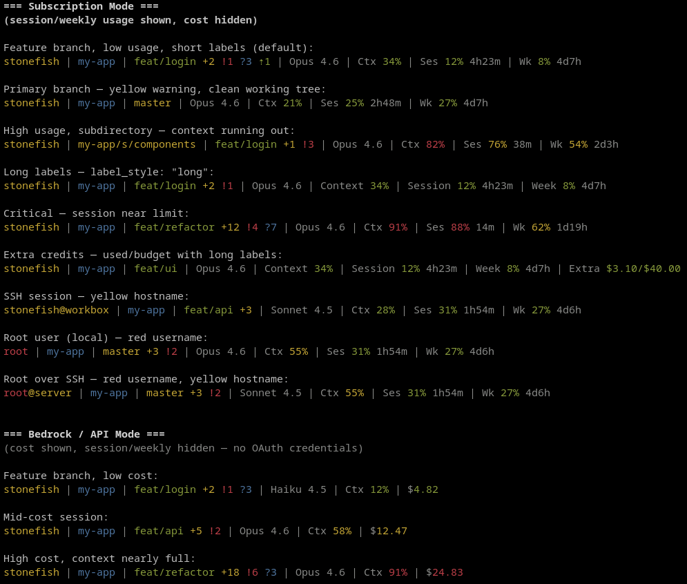

# claude-statusline

A pure Bash status line for [Claude Code](https://docs.anthropic.com/en/docs/claude-code). Replaces the Python-based claude-pulse with a single self-contained script — no Python runtime, no pip, no virtualenv.

## Examples



## Features

- **Configurable segments** — user, directory, git, model, context window, session usage, weekly usage, extra credits, cost
- **Fast git status** — uses [gitstatusd](https://github.com/romkatv/gitstatus) when available, falls back to `git` CLI
- **Usage tracking** — fetches session (5h) and weekly (7d) utilization from the Anthropic API with local caching
- **Color-graded indicators** — green/yellow/red thresholds for usage percentages and cost
- **Fully config-driven** — all settings have baked-in defaults; works with zero configuration

## Segments

| Segment | Output | Auto-hide |
|---------|--------|-----------|
| `user` | `stonefish` or `stonefish@host` (SSH) | never |
| `dir` | `project/s/subdir` (abbreviated path) | if no cwd data |
| `git` | `main +2 !1 ?3 ⇡1` | if not a git repo |
| `model` | `Opus 4.6` | if absent from stdin |
| `context` | `Ctx 34%` | never (shows 0%) |
| `session` | `Ses 12% 4h23m` | if no OAuth credentials |
| `weekly` | `Wk 8% 4d7h` | if no OAuth credentials |
| `extra` | `Ex $3.10/$100.00` | if not enabled or $0 used |
| `cost` | `$1.24` | if in subscription mode or $0 |

## Requirements

- `bash` 4+
- `jq`
- `curl`
- `awk`
- `git`
- `gitstatusd` (optional — improves git status performance)

## Install

```bash
git clone git@github.com:St0nefish/claude-statusline.git
cd claude-statusline
./install.sh
```

The install script will:
1. Check for required dependencies
2. Create the cache directory at `~/.cache/claude-statusline/`
3. Configure `~/.claude/settings.json` to use the status line (preserves existing settings)

## Configuration

All settings have sensible defaults. To customize, create a config file:

```bash
mkdir -p "${XDG_CONFIG_HOME:-$HOME/.config}/claude-statusline"
cp config.json "${XDG_CONFIG_HOME:-$HOME/.config}/claude-statusline/config.json"
```

Then edit to taste:

```json
{
  "segments": ["user", "dir", "git", "model", "context", "session", "weekly", "extra", "cost"],
  "separator": " | ",
  "cache_ttl": 60,
  "git_cache_ttl": 5,
  "path_max_length": 40,
  "show_host": "auto",
  "git_backend": "auto",
  "label_style": "short",
  "cost_thresholds": [5, 20],
  "extra_hide_zero": true,
  "currency": "$"
}
```

### Settings reference

| Setting | Default | Description |
|---------|---------|-------------|
| `segments` | all segments | Ordered list of segments to display. Remove a segment to disable it. |
| `separator` | `" \| "` | String between segments |
| `cache_ttl` | `60` | Seconds to cache API usage responses |
| `git_cache_ttl` | `5` | Seconds to cache git status |
| `path_max_length` | `40` | Max display length for directory path |
| `show_host` | `"auto"` | Show hostname: `"auto"` (SSH only), `"always"`, `"never"` |
| `git_backend` | `"auto"` | Git backend: `"auto"`, `"daemon"` (gitstatusd only), `"cli"` (git only) |
| `label_style` | `"short"` | Segment labels: `"short"` (Ctx, Ses, Wk) or `"long"` (Context, Session, Week) |
| `cost_thresholds` | `[5, 20]` | Dollar thresholds for green→yellow→red cost coloring |
| `extra_hide_zero` | `true` | Hide extra credits segment when $0 used |
| `currency` | `"$"` | Currency symbol for cost and extra segments |

### Colors

All colors are [256-color ANSI codes](https://en.wikipedia.org/wiki/ANSI_escape_code#8-bit) or keywords (`dim`, `bold`, `reset`). Override any color in the `colors` object:

```json
{
  "colors": {
    "low": "76",
    "mid": "178",
    "high": "196",
    "separator": "dim",
    "git_branch_feature": "76",
    "git_branch_primary": "178",
    "git_staged": "178",
    "git_unstaged": "196",
    "git_untracked": "39",
    "git_ahead": "76",
    "git_behind": "196",
    "label": "dim",
    "model": "dim",
    "user": "3",
    "user_root": "196",
    "host": "dim",
    "dir": "31",
    "reset_time": "dim",
    "cost": "76"
  }
}
```

### Color behavior

| Element | Condition | Color |
|---------|-----------|-------|
| Usage (context, session, weekly) | <50% / 50-79% / ≥80% | green / yellow / red |
| Cost | below/between/above `cost_thresholds` | green / yellow / red |
| Branch name | on primary branch / feature branch | yellow / green |
| Directory | at project root / subdirectory | blue / yellow |
| Username | normal user / root | yellow / red |
| Hostname | shown on SSH | yellow |
| Ahead/behind | commits ahead / behind | green / red |

## How it works

Claude Code pipes JSON on stdin with model info, context window usage, cost, and workspace paths. The script parses this with a single `jq` call, fetches git status (via gitstatusd or `git` CLI with caching), optionally fetches API usage data (with OAuth token from `~/.claude/.credentials.json`), and assembles the configured segments into a colored status line.

## License

MIT
